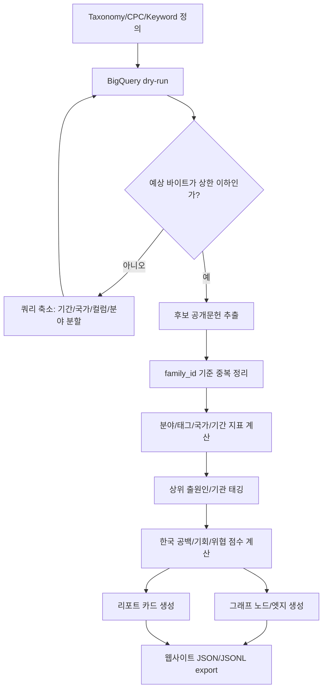

# BigQuery 기반 항공우주/상용항공 특허조사 실행계획

작성일: 2026-06-26

## 1. 조사 방향 확정

이번 조사는 항공우주 분야 전체 동향을 빠르게 이해하고, 연구기획과 사업개발에 바로 쓸 수 있는 분석 데이터셋을 만드는 것이 목적이다.

확정 조건:

- 범위: 우주 + 항공 포함
- 항공 우선순위: 민간/상용항공 중심
- UAV/AAM/드론: 항공 하위 태그로 처리
- 방산/군사용 기술: 제외하지 않고 `defense_relevance`, `dual_use` 태그로 표시
- 국가 기준: 공개국가 `country_code`
- 집계 기준: 패밀리 수를 메인, 공개문헌 수를 보조
- 텍스트 범위: 1차는 제목/초록/메타 중심
- 비용 조건: 월 0원 목표

## 2. 기간 기준

특허는 출원 후 대개 공개까지 시간이 걸리므로, 1개월/1년 자료만으로 기술 동향을 판단하면 왜곡될 수 있다. 따라서 수집과 화면 표시 기준을 분리한다.

| 구분 | 기준 날짜 | 기간 | 용도 |
|---|---|---:|---|
| 장기 판세 | `priority_date` | 최근 10년 | 분야 전체 경쟁구도, 누적 기술축 |
| 기본 대시보드 | `priority_date` | 최근 5년 | 현재 기술동향, 국가별 강점 |
| 급상승 분석 | `priority_date` | 최근 3년 | emerging trend, 사업화 후보 |
| 신규 공개 | `publication_date` | 최근 1년 | watchlist, 경쟁사 모니터링 |
| 월간 신규 | `publication_date` | 최근 1개월 | 월간 업데이트 카드 |
| 권리화 신호 | `grant_date` | 최근 1년 | 등록문헌, 사업 리스크 후보 |

웹사이트 기본 화면은 최근 5년을 보여주고, 상세 필터로 1개월/1년/3년/10년을 전환한다.

## 3. 분야 체계

메인 대시보드는 9개 분야로 구성한다.

| ID | 화면명 | 도메인 |
|---|---|---|
| `space_launch_propulsion_recovery` | 발사체/추진/회수 | Space |
| `space_satellite_bus_thermal_power` | 위성 플랫폼/열제어/전력 | Space |
| `space_comm_leo_network` | 위성통신/LEO 네트워크 | Space |
| `space_remote_sensing_payload` | SAR/원격탐사 페이로드 | Space |
| `space_gnc_rendezvous_servicing` | GNC/랑데부/온오빗 서비스 | Space |
| `space_materials_tps_coatings` | 우주재료/TPS/코팅 | Space |
| `aviation_propulsion_sustainable` | 상용항공 추진/전기추진/수소/SAF | Aviation |
| `aviation_structures_aero_composites` | 항공 구조/복합재/공력 | Aviation |
| `aviation_avionics_flight_control_autonomy` | 항전/비행제어/자율비행 | Aviation |

하위 태그:

- `uav_aam_drone`
- `commercial_aviation`
- `defense_relevance`
- `public_research`
- `private_company`

분류 방식은 CPC/IPC와 제목/초록 키워드 점수를 결합한다. 하나의 문헌이 여러 분야에 걸치면 복수 분류를 허용하되, UI에서는 최고 점수 분야를 대표 분야로 표시한다.

## 4. BigQuery 데이터 소스

1차 소스:

- `patents-public-data.patents.publications`

주요 필드:

- `publication_number`
- `country_code`
- `family_id`
- `title_localized`
- `abstract_localized`
- `publication_date`
- `priority_date`
- `grant_date`
- `assignee_harmonized`
- `cpc`
- `citation`

보조 소스:

- `patents-public-data.google_patents_research.publications`

보조 필드:

- `title`
- `abstract`
- `top_terms`
- `similar`
- `cited_by`
- `embedding_v1`

1차 landscape에서는 보조 소스의 embedding과 description은 쓰지 않는다. 비용과 처리량을 줄이기 위해 필요할 때만 상세 분석에 사용한다.

## 5. 수집 파이프라인



## 6. 저장 산출물

웹사이트는 BigQuery를 실시간으로 직접 호출하지 않는다. 월 1회 수집 스크립트가 아래 파일을 생성하고, 사이트는 정적 JSON/JSONL을 읽는다.

```text
normalized/bq_patents.jsonl
normalized/bq_families.jsonl
normalized/bq_evidence_chunks.jsonl
analysis/bq_field_country_period_metrics.json
analysis/bq_country_portfolio.json
analysis/bq_assignee_rankings.json
analysis/bq_korea_gap_opportunity_scores.json
analysis/bq_monthly_watchlist.json
graph/bq_nodes.jsonl
graph/bq_edges.jsonl
reports/bq_site_report_cards.json
reports/bq_landscape_report_ko.md
```

## 7. 핵심 지표

| 지표 | 계산 기준 | 목적 |
|---|---|---|
| 패밀리 수 | `COUNT(DISTINCT family_id)` | 실제 발명 규모 |
| 공개문헌 수 | `COUNT(DISTINCT publication_number)` | 국가별 공개 활동 |
| 최근 5년 성장률 | priority year 기준 | 현재 동향 |
| 최근 3년 모멘텀 | priority year 기준 | 급상승 분야 |
| 국가 포트폴리오 | 분야 x 공개국가 | 국가별 강점 비교 |
| 패밀리 확장성 | family별 공개국가 수 | 시장 진입/권리화 의지 |
| 출원인 집중도 | 상위 출원인 점유율 | 진입장벽/경쟁강도 |
| 한국 공백 점수 | 글로벌 모멘텀 x 낮은 KR 비중 | 연구기획 기회 |
| 사업화 점수 | 최근 증가 x 민간기업 비중 x 패밀리 확장 | 사업개발 후보 |
| 위협 점수 | 특정 국가 급증 x 대형 출원인 집중 | 경쟁/위협 감지 |

## 8. 한국 공백/기회 분석

한국 리포트는 강하게 보여준다. 단, "한국이 약하다"가 아니라 "세계 성장 대비 한국 공개문헌이 적은 기회 영역"으로 표현한다.

기본 산식:

```text
korea_gap_opportunity_score
= global_recent_3y_momentum * (1 - kr_recent_5y_share)
```

보완 지표:

- 대표 해외 출원인
- 한국 관련 출원인 존재 여부
- 최근 1년 신규 공개 여부
- 사업화 가능성 태그
- 방산/dual-use 관련성

## 9. 화면 설계

### 9.1 첫 화면

첫 화면은 검색창보다 분석 결과를 먼저 보여준다.

상단 KPI:

- 전체 특허 패밀리
- 최근 5년 성장률
- 급상승 분야
- 선도 공개국가
- 한국 공백/기회 분야

메인 차트:

- 분야 x 국가 히트맵
- 최근 10년 분야별 stacked area chart
- 국가별 분야 mix bar
- 상위 출원인 랭킹
- 월간 신규 공개 카드

### 9.2 분야 상세

표시 항목:

- 최근 10년 추세
- 최근 3년 급상승 여부
- 공개국가 분포
- 상위 출원인/기관
- 대표 패밀리
- 주요 CPC/키워드
- 한국 공백/기회 해석
- 사업개발 메모

### 9.3 국가 비교

표시 항목:

- 국가별 분야 포트폴리오
- 분야별 선도 국가
- 한국 대비 격차
- 최근 1년 신규 공개 문헌

### 9.4 Graph View

노드:

- Field
- Sub tag
- Country
- Assignee
- Patent Family
- Publication
- CPC
- Keyword

엣지:

- `CLASSIFIED_AS`
- `PUBLISHED_IN`
- `IN_FAMILY`
- `ASSIGNED_TO`
- `HAS_CPC`
- `CITES`
- `SIMILAR_TO`
- `MENTIONS_TERM`

UX:

1. 초기 화면은 9개 분야 성단을 은하수처럼 표시한다.
2. 분야 클릭 시 카메라가 해당 성단으로 이동한다.
3. 오른쪽 보고서 카드가 열리고 성장률, 선도국가, 한국 공백, 대표 특허를 보여준다.
4. 출원인 노드를 클릭하면 해당 기업/기관의 분야 포트폴리오를 보여준다.

## 10. 월 0원 운영 규칙

BigQuery public dataset은 저장비는 Google이 부담하고, 쿼리한 바이트 기준으로 과금된다. 공식 문서 기준 첫 1TB/month 쿼리 처리량은 무료 구간이다. 그래도 월 0원 조건을 지키기 위해 다음 규칙을 강제한다.

운영 규칙:

- 모든 새 쿼리는 dry-run 먼저 실행한다.
- 모든 실제 쿼리는 `maximumBytesBilled`를 설정한다.
- `SELECT *`를 금지한다.
- 1차 조사에서는 claims, description, embedding을 대량 조회하지 않는다.
- 월간 업데이트는 최근 1~2개월 `publication_date`만 조회한다.
- 웹사이트는 BigQuery가 아니라 저장된 JSON/JSONL만 읽는다.
- 쿼리 예상량이 상한을 넘으면 기간/국가/분야별로 분할한다.

기본 상한:

- 탐색 쿼리: 512MB
- 일반 미검증 실행: 2GB
- 승인된 CPC-first 쿼리: 30GB
- dry-run 기본 검토 상한: 10GB
- 제목/초록 직접 스캔 차단 기준: 100GB 이상

2026-06-26 dry-run 결과:

| 쿼리 | 예상 처리량 | 결정 |
|---|---:|---|
| 스키마 확인 | 0.0098GiB | 안전 |
| 10년 후보 CPC-first | 24.6887GiB | 검토 후 실행 가능 |
| 월간 모니터링 CPC-first | 24.6887GiB | 월 1회 실행 가능 |
| 10년 제목/초록 직접 검색 | 233.9753GiB | 1차/정기 실행 금지 |
| 월간 제목/초록 직접 검색 | 235.9841GiB | 월간 실행 금지 |

따라서 정기 운영은 CPC-first로 후보를 좁힌 뒤, 후보 공개번호만 제목/초록으로 보강한다.

## 11. 실행 순서

1. `config/bigquery_aerospace_aviation_taxonomy.json` 검토
2. `sql/01a_candidate_10y_cpc_first_production.sql` dry-run
3. 예상 바이트가 크면 분야별로 query split
4. 작은 후보 테이블 또는 로컬 JSON export 생성
5. family dedupe
6. metrics/report/graph 생성
7. 분야별 샘플 50건으로 분류 precision 검증
8. 사이트에 연결
9. 월 1회 `sql/02a_monthly_watch_cpc_first_production.sql`만 갱신

## 12. 사용 명령

Dry-run:

```powershell
node .\scripts\bq_safe_query.js --file .\sql\01_candidate_10y_core_dryrun.sql
```

권장 dry-run:

```powershell
node .\scripts\bq_safe_query.js --max-bytes 32212254720 --file .\sql\01a_candidate_10y_cpc_first_production.sql
```

월간 모니터링 실제 실행:

```powershell
node .\scripts\bq_safe_query.js --run --max-bytes 32212254720 --file .\sql\02a_monthly_watch_cpc_first_production.sql
```

실제 실행은 dry-run 예상량을 확인한 뒤에만 한다.

## 13. 신뢰성 표시 규칙

화면과 리포트에서는 아래 표현을 지킨다.

- `country_code` 지표는 항상 "공개국가 기준"이라고 표시한다.
- `assignee_country_codes` 지표는 "출원인 국적/소재지 기준"이라고 표시한다.
- `grant_date`는 "권리화 신호"로 표시하고, "유효 특허"라고 단정하지 않는다.
- 한국 분석은 "한국 공백 후보" 또는 "한국 기회 후보"로 표시한다.
- 분야 분류 precision 검증 전에는 "탐색 지표" 배지를 붙인다.
